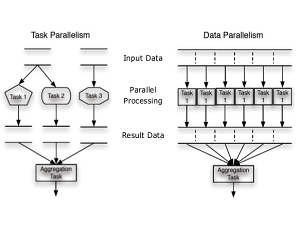
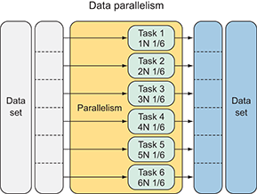

<h1 align="center">
    <b>
        <br>
        # Tugas Besar 1 IF3230 Sistem Paralel dan Terdistribusi
        <br>
    </b>
</h1>

<h2 align="center">
    <b>
        <br>
        OpenMPI - Dijkstra Algorithm
        <br>
        <br>
    </b>
</h2>

## Petunjuk Penggunaan Program
* Compile: <br>
  ketikan ```make``` pada direktori tempat ```makefile``` berada
* Run: <br>
  ketikan ```run``` pada direktori tempat ```makefile``` berada

## Laporan Pengerjaan
### Deskripsi Solusi Paralel
Solusi paralel yang dilakukan adalah data parallelism karena data yang ada dibagi-bagi ke *thread* yang ada, sehingga *thread* pusat hanya bertugas untuk menerima hasil dari pemrosesan algoritma dijkstra yang dilakukan oleh *thread* lain. Hasil pemrosesan algoritma dijkstra merupakan satu baris dari matriks jarak antar node. <br>
<div align="center">
    
</div>

Cara kerja program:
1. Program menginisiasi graf dalam bentuk matriks berukuran N x N
2. Untuk setiap baris dan kolom, program mengisi nilai *random* yang didapat dari funsi ```rand()``` dengan seed ```13517020``` atau ```13517137```
3. Program mulai menjalankan algoritma dijkstra untuk mencari nilai cost minimum yang dibutuhkan dari node-x untuk mencapai node-y
   * Jika jumlah *thread* yang digunakan hanya 1, program akan menjalankan algoritma dijkstra secara serial
   * Jika jumlah *thread* yang digunakan lebih dari 1, program akan menjalankan algoritma dijkstra secara paralel
     * *thread* dengan nilai ```rank = 0``` menerima hasil pemrosesan graf menggunakan algoritma dijkstra dari *thread-thread* lain
     * *thread* dengan nilai ```rank ≠ 0``` melakukan pemrosesan graf menggunakan algoritma dijkstra untuk dikirimkan ke *thread* dengan nilai ```rank = 0```

### Analisis Solusi
* Kelebihan:
  * Jika *thread* yang digunakan hanya 1 program akan langsung menjalankan algoritma dijkstra secara serial
  * Lebih hemat *memory space* karena alokasi *memory* menyesuaikan input jumlah nodes
* Kelemahan:
  * Graf harus digenerate oleh setiap *thread*
* Solusi yang lebih baik:
  * Semua *process* algoritma djikstra membaca dan menuliskan pada address yang sama

### Jumlah Thread yang Digunakan
6 *thread* karena dari hasil percobaan kami, waktu yang dibutuhkan untuk mendapatkan solusi dengan menggunakan 6 thread jauh lebih cepat dibandingkan jika menggunakan 5 thread, 4 thread, 3 thread, 2 thread dan 1 thread (serial). Hal ini disebabkan oleh jumlah data yang dibagi untuk setiap thread menurun sesuai dengan banyaknya thread yang digunakan sehingga thread dapat menyelesaikan tugasnya lebih cepat.
<div align="center">
    
</div>

### Pengukuran Kinerja Algoritma Paralel dengan Serial
| Jumlah Thread | Jumlah Node | Waktu 1 (μs) | Waktu 2 (μs) | Waktu 3 (μs) |
|:-------------:|:-----------:|:------------:|:------------:|:------------:|
|   1 (Serial)  |         100 |        49307 |        34070 |        33892 |
|   1 (Serial)  |         500 |      1741475 |      1176024 |      1033807 |
|   1 (Serial)  |        1000 |     14905097 |      8278146 |      9279655 |
|   1 (Serial)  |        3000 |    238046050 |    242131287 |    239485461 |
|   2 (Paralel) |         100 |        64976 |        39307 |        53852 |
|   2 (Paralel) |         500 |      1075717 |      1271727 |      1280256 |
|   2 (Paralel) |        1000 |     12198962 |      9334894 |     10188746 |
|   2 (Paralel) |        3000 |    256132060 |    266134121 |    254616140 |
|   3 (Paralel) |         100 |        50223 |        41098 |        47145 |
|   3 (Paralel) |         500 |       740905 |       684402 |       772519 |
|   3 (Paralel) |        1000 |      4928429 |      4765061 |      4621832 |
|   3 (Paralel) |        3000 |    151653749 |    149274832 |    153114263 |
|   4 (Paralel) |         100 |        43992 |        40993 |        55301 |
|   4 (Paralel) |         500 |       535659 |       546592 |       828609 |
|   4 (Paralel) |        1000 |      3274332 |      3222809 |      3061511 |
|   4 (Paralel) |        3000 |    121828419 |    122257356 |    121627342 |
|   5 (Paralel) |         100 |        45598 |        42189 |        42876 |
|   5 (Paralel) |         500 |       357208 |       359947 |       673483 |
|   5 (Paralel) |        1000 |      2134835 |      2032780 |      2241675 |
|   5 (Paralel) |        3000 |     60491013 |     61324614 |     60779521 |
|   6 (Paralel) |         100 |        40593 |       124807 |        40528 |
|   6 (Paralel) |         500 |       245153 |       287382 |       284934 |
|   6 (Paralel) |        1000 |      1556061 |      2258942 |      1286586 |
|   6 (Paralel) |        3000 |     45365843 |     51572403 |     46935291 |

### Analisis Perbandingan Kinerja Serial dan Paralel
Algoritma dijkstra yang dijalankan secara serial memakan waktu jauh lebih lama dibandingkan algoritma dijkstra yang dijalankan secara paralel dengan menggunakan *thread* lebih dari 2 karena pembagian data yang diproses oleh setiap thread berkurang cukup banyak seiring dengan bertambahnya jumlah *thread* yang digunakan. Tetapi khusus untuk algoritma dijkstra yang dijalankan secara paralel menggunakan 2 *thread*, waktu yang dibutuhkan lebih lama dibandingkan algoritma  dijkstra yang dijalankan secara serial karena jumlah data yang diproses oleh satu *thread* sama dengan jumlah data yang diproses secara serial (*main thread* bertugas hanya untuk menerima hasil dari *thread* lain) dan membutuhkan waktu untuk mengirimkan hasil dari *thread* yang memroses data ke *main thread*.
| Jumlah Thread | Jumlah Data yang Diproses 1 Thread | Perkiraan Waktu yang Dibutuhkan                  |
|:-------------:|:----------------------------------:|:------------------------------------------------:|
|    1 (Serial) |                            $$ N $$ |                               $$ T_{dijkstra} $$ |
|   2 (Paralel) |                            $$ N $$ |            $$ T_{dijkstra} + T_{send-receive} $$ |
|   3 (Paralel) |                 $$ \tfrac{N}{2} $$ | $$ \tfrac{T_{dijkstra}}{2} + T_{send-receive} $$ |
|   4 (Paralel) |                 $$ \tfrac{N}{3} $$ | $$ \tfrac{T_{dijkstra}}{3} + T_{send-receive} $$ |
|   5 (Paralel) |                 $$ \tfrac{N}{4} $$ | $$ \tfrac{T_{dijkstra}}{4} + T_{send-receive} $$ |
|   6 (Paralel) |                 $$ \tfrac{N}{5} $$ | $$ \tfrac{T_{dijkstra}}{5} + T_{send-receive} $$ |


## Pembagian Tugas
* 13517020 mengerjakan fungsi algoritma dijkstra, output to file, makefile dan laporan
* 13517137 mengerjakan fungsi graph generator, output to file, makefile dan laporan